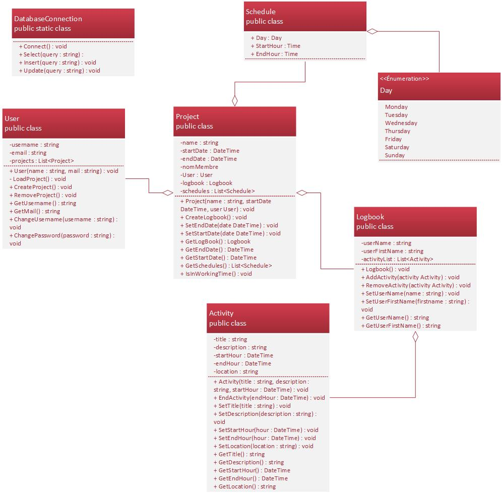

# Logy

## - Document de conception -

### 1. Matériel hardware

Ce projet est réalisé sur diverses machines : les PC du CPNV ainsi que nos ordinateurs personnels.

##### Spécifications

|    |     |
|----|-----|
|PC CPNV| - Windows 10 Education, 64 bits   - 16 Go RAM   - Intel Core i7-6700 3.40 GHz|
|PC personnel 1|- Windows 10, 64 bits   - 16 Go RAM,   - AMD Ryzen 7 1800x|
|MAC CPNV||

### 2. Logiciels et librairies

Pour la réalisation de cet application nous utilisons les outils/logiciels et librairies suivantes.

###### Outils/Logiciels
* Visual Studio 2017 - Programmation
* Atom - Éditeur de text pour la documentation
* Visio 2016 - Pour les différents diagrammes
* MkDocs - Outils pour générer une documention HTML à partir de markdown
* MySQL - Base de donnée utilisée
* MySQL Workbench - Création de MLD et exportation en script SQL

###### Librairies/Framework
* Xamarin - Permet la réalisation d'applications mobiles
* Realms - Système de base de donnée comme SQLite optimisé pour Xamarin

### 3. Base de données
MCD et MLD de la base de données.

#### 3.1 MCD

#### 3.2 MLD

### 4. Diagramme UML de classes
Le diagramme UML de l'application, représentant toutes ses classes et leurs relations.

