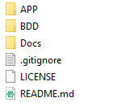
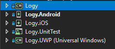

# Logy
## Document de réalisation

### Dossier du projets

* APP : Contient les sources du projet
* BDD : Contient la documention de la base de données
* Docs : Contient la documentation de logy sous forme de site web

### Projets Visual Studio

* Le projet logy est une librairie commune aux projets Logy.Android,Logy.IOS,Logy.UWP. Elle contient le code qui est commun au autres projets
* Le projet Logy.Android est la version android de l'applications.
* Le projet Logy.iOS est la version iOS de l'applications.
* Le projet Logy.UWP est la version windows de l'applications.
* le projet Logy.UnitTest est un projet qui permet de tester les classes et les méthodes du projet logy

### Projet Logy

* Assets : Contient tous les ressources du projet
* Classes : Contient les classes du projet
* Database : Contient les classes et les tables liers à la base de donnée
* View : Contient les interfaces du projet

#### Assets

* Images: Contient les images liers au projet

#### Classes

#### Database

* Tables : Contient les fichiers de classes représentant les tables de la base de donnée
* DatabaseManager.cs : Permet de gérer les intérations avec la base de donnée

#### View

### Version des outils

* Visual studio 2017 : 15.8.4
  * NETStandard.Library : 2.0.3
  * sqlite-net-pcl : 1.5.231
  * System.Data.SQLite : 1.0.109.2
  * Xamarin.Forms : 3.1.0.697729
  * Xamarin : 4.11.0.756
  * Xamarin Designer : 4.14.221
  * Xamarin Templates : 1.1.116
  * Xamarin.Android SDK : 9.0.0.19
  * Xamarin.iOS and Xamarin.Max SDK : 11.14.0.13
* Windows 10 Éducation 64-bits
* Windows 10 Home 64-bits

### Matériel

|    |     |
|----|-----|
|PC CPNV|Intel Core i7-6700 3.40 GHz -   16 Go RAM|
|PC personnel 1|AMD Ryzen 7 1800x   - 16 Go RAM|
|PC personnel 2|Core i7-6700HQ 2.6 GHz 2   - 16 Go RAM|
|MAC CPNV|Mac mini|

### Lancement de l'application à partir des sources

Pour utiliser depuis les sources il vous faudra Visual studio 2017 installé avec Xamarin d'installer, une fois cela fais il vous faudra télécharger les sources sur repository et ouvrire le fichier Logy.sln qui se trouve dans Logy/APP/Logy
