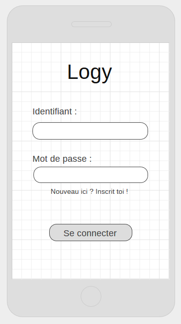
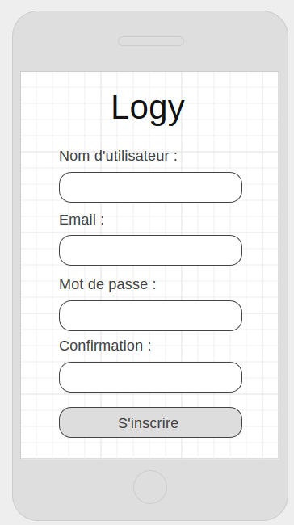
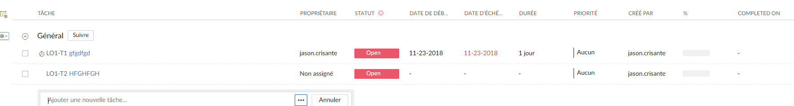
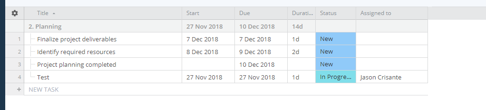

# Logy

## Introduction
### Cadre, description et motivation
Logy est une application mobile développée en C# permettant notamment d’administrer son journal de bord, l’application rappellera à l’utilisateur de remplir son journal de bord. Les faits qui nous ont motivés sont principalement notre départ en stage où nous devrons alors fournir en fin de chaque semaine un journal de bord des activités effectuées lors de la semaine, nous savons également que certaine fois on oublie de remplir le journal de bord.

### Organisation générale du projet

Chef de projet :

|Nom|Prénom|Email|
|---|------|-----|
|Ithurbide|Julien|Julien.Ithurbide@cpnv.ch|

Développeurs :

|Nom|Prénom|Email|
|---|------|-----|
|Aellen|Quentin|Quentin.aellen@cpnv.ch|
|Niclass|Dorian|Dorian.Niclass@cpnv.ch|
|Crisante|Jason|Jason.Crisante@cpnv.ch|

### Objectif

L'application doit être :

* Multiplateforme
* Intuitive
* Résistive
* Fonctionnelle
* Esthétique
* Stable
* Rendu dans les temps

### Planification

L’organisation du projet sera principalement basée sur une méthode agile à l’aide de l’outil intégré de Github.

## Analyse
### Cahier des charges
#### MCD

#### Wireframe

#### Cas d'utilisation et scénarios

##### Visiteur :

|**Action**|**Résultat attendu**|
|------|----------------|
|Le visiteur lance l’application|L’application s’ouvre et propose à l’utilisateur de s’identifier ou de crée un compte.|
|Le visiteur ferme l’application|L’application se ferme.|

###### Connexion

|**Action**|**Résultat attendu**|
|----------|--------------------|
|Le visiteur appuie sur le bouton « Se connecter ».|L’application affiche un formulaire de connexion.|
|Le visiteur entre des identifiants incorrect et appuie se le bouton « Se connecter ».|L’application essaye les identifiants et signal à l’utilisateur que ses identifiants sont faux.|
|Le visiteur entre des identifiants correct et appuie se le bouton « Se connecter »|L’application essaye les identifiants et signal à l’utilisateur que ses identifiants sont juste. Il affiche ensuite le menu principal de l’application.|
|Le visiteur entre des identifiants correct, coche la case « Se souvenir de moi » et appuie se le bouton « Se connecter »|L’application essaye les identifiants et signal à l’utilisateur que ses identifiants sont juste. Il affiche ensuite le menu principal de l’application et enregistre qu’elle doit se souvenir de l’utilisateur.|

##### Membre :

###### Connexion

|**Action**|**Résultat attendu**|
|----------|--------------------|
|Une fois connecté le visiteur devient un membre|La page principale de l’application s’affiche|

###### Projet

|**Action**|**Résultat attendu**|
|----------|--------------------|
|L’utilisateur appuie sur le bouton « Nouveau projet »|L’application ouvre un formulaire demandant les informations du projet|
|L’utilisateur ne remplit pas les champs|L’application affiche une erreur et demande que les champs nom et date de début soie remplit |
|L’utilisateur remplit que le nom|L’application affiche une erreur et demande que le champ date de début soie remplit|
|L’utilisateur remplit le champ nom et date de début|L’application crée le nouveau projet et fait revenir l’utilisateur sur la page principale de l’application|
|L’utilisateur remplit tous les champs|L’application crée le nouveau projet et fait revenir l’utilisateur sur la page principale de l’application|

###### Journal de bord

|**Action**|**Résultat attendu**|
|----------|--------------------|
|L’utilisateur clique sur l’un des projets qu’il a crée|L’application ouvre le journal de bord|
|L'utilisateur clique sur le bouton ajouter une activité|L'application ouvre un formulaire d'ajout d'activités|
|L'utilisateur remplit que le champ title| L'application lui demande de remplir les autres champs nécessaires|
|L'utilisateur remplit tout les champs nécessaires| L'application ajoute l'activité est redirige vers la page du journal de bord|

###### Options

|**Action**|**Résultat attendu**|
|----------|--------------------|
|L'utilisateur appuie sur les boutons options| L'application affiche les options du projet|
|L'utilisateur edite le champ nom du projet|L'application active le bouton enregistrer|
|L'utilisateur appuie sur le bouton enregistrer| L'application va mettre à jour les données|
|L'utilisateur edit les champs nom du projet, nom du journal de bord|L'application active le bouton enregistrer|
|L'utilisateur définit des horaires de travail |L'application active le bouton enregistrer|
|L'utilisateur appuie sur enregistrer| L'application mets à jour la base de données|

##### Analyse Concurrentielle
###### Avantages et désaventages
|**Nom**|**Avantages**|**Désaventages**|
|-------|-------------|----------------|
|Excel|Tableur dans lequel on peut facilement rentrer toute sorte de données et qui permet de faire un journal de bord avec| Pas fait pour ça à la base et il est payant|
|Zoho Project| Gestionnaire de projet Web gratuit, Super design, Facile d'utlisation et pleins de fonctionnalité différentes | Application Web -> Connexion obligatoire, pages un peu trop remplies, quelques bugs de responsivité|
|Wrike|Application mobile,responsive,pleins de fonctionnalités, Les projets peuvent etre privé ou partagé et c'est bien différencié|Beaucoup d'options, On se perd un peu|

###### Exemple Graphique

* Excel

* Zoho Project

* Wrike

